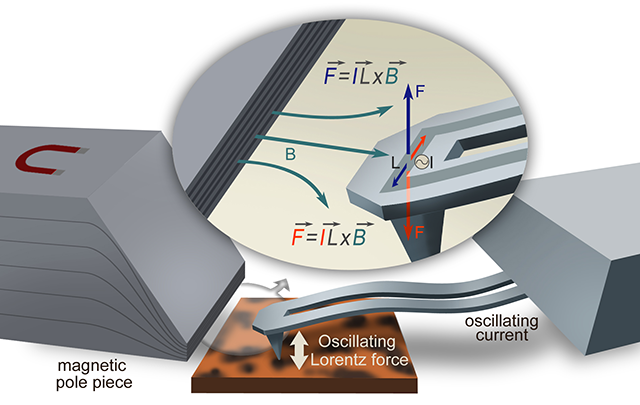

+++
date = "2020-08-31"
lastmod = "2020-08-31"
draft = false
tags = ["LCR"]
title = "Lorentz Contact Resonance "
summary = """Lorentz Contact Resonance 
"""
math = false

# Featured image
# To use, add an image named `featured.jpg/png` to your project's folder. 
[image]
  # Caption (optional)
  caption = "LCR"
  
  # Focal point (optional)
  # Options: Smart, Center, TopLeft, Top, TopRight, Left, Right, BottomLeft, Bottom, BottomRight
  focal_point = "Smart"

+++

The Lorentz Contact Resonance (LCR) allows rapid broadband nanomechanical measurements over a range of temperatures, identifying key sample measurement contrasts, and allowing precise probe placement for subsequent chemical or thermal analysis with nanoscale resolution.

Lorentz Contact Resonance is based on the Lorentz force, the force on an electrical current in a magnetic field. An oscillating current passing through the Thermalever™ probe interacts with a magnetic field that is focused near the probe, resulting in a perpendicular oscillating tip sample force. The frequency of the oscillating current on the cantilever can be rapidly changed to measure nanomechanical spectra of contact resonances. Driving the tip in this fashion, instead of with a piezoelectric crystal, has many advantages, including no moving parts in the drive system leading to clean cantilever resonance spectra with no parasitic peaks. Because there are no moving parts actuating the cantilever, Lorentz Contact Resonance provides a very clean excitation over broad frequency ranges (bottom plot). Piezo drive schemes (top plot) can excite many spurious resonances that interfere with contact resonance measurements and interpretation of the results.

*Source: https://www.bruker.com/en/products-and-solutions/infrared-and-raman/nanoscale-infrared-spectrometers/lorentz-contact-resonance.html*

