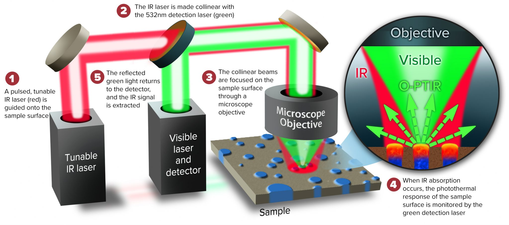

+++
date = "2019-03-15"
lastmod = "2019-03-15"
draft = false
tags = ["O-PTIR"]
title = "O-PTIR Microscope mIRage Photothermal Spectroscopy"
summary = """O-PTIR Microscope mIRage Photothermal Spectroscopy
"""
external_link = ""
math = false

# Featured image
# To use, add an image named `featured.jpg/png` to your project's folder. 
[image]
  # Caption (optional)
  caption = "PSC mIRage"
  
  # Focal point (optional)
  # Options: Smart, Center, TopLeft, Top, TopRight, Left, Right, BottomLeft, Bottom, BottomRight
  focal_point = "Smart"

+++

## O-PTIR (optical Photothermal IR) spectroscopy

- A pump-probe optical spectroscopy technique (“pump” - an IR laser , “probe” - a short-wavelength visible/NIR laser)
- Sub-micron spatial resolution: Raman-like spatial resolution, with IR spectral information
- FTIR transmission-like spectra in reflection mode by measuring the response of IR absorption (no distortions, artefacts or interference fringes) 
- Non-contact technique that minimizes sample preparation and preserve molecular orientation
- Spatial resolution is IR wavelength independent

## mIRage - How it works?
 *Source: https://www.photothermal.com/o-ptir/*

## Applications overview

- Industrial
  - Particulates
  - Chemical
  - Micro-electronics
  - Failure/Defect analysis
  - Organic contamination
  - Fibers
  
- Academic Research
  - Life Sciences
  - Polymers
  - Geological Sciences
  - Microplastics
  - Cultural Heritage
  - Pharmaceutical

