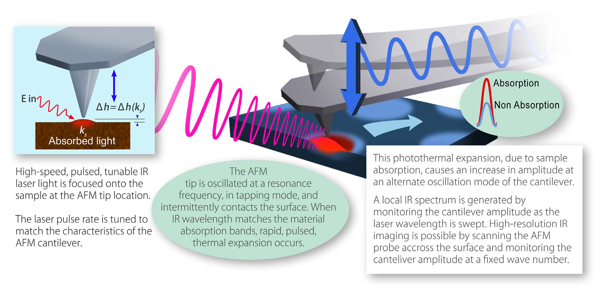

+++
date = "2019-03-15"
lastmod = "2019-03-15"
draft = false
title = "AFM-IR Microscope nanoIR3"
summary = "AFM-IR Microscope nanoIR3"
tags = ["AFM-IR"]
external_link = ""
math = false

# Featured image
# To use, add an image named `featured.jpg/png` to your project's folder. 
[image]
  # Caption (optional)
  caption = "Anasys/Bruker Nano nanoIR3"
  
  # Focal point (optional)
  # Options: Smart, Center, TopLeft, Top, TopRight, Left, Right, BottomLeft, Bottom, BottomRight
  focal_point = "Smart"

+++
# Anasys/Bruker Nano nanoIR3
The nanoIR3 is the latest generation nanoscale IR spectroscopy, chemical imaging, and property mapping system for both materials and life science applications. The system also provides IR-based chemical imaging to provide mapping of chemical variations of the feature of interest. Unique point spectroscopy capabilities provide both spectroscopy and chemical imaging with a single source.

Features:

- **Model free IR spectroscopy:** 
      reliable acquisition of nanoscale absorption data
- **Sub-10 nm Tapping AFM-IR:**
      chemical mapping at the highest spatial resolution, high-quality IR spectroscopy.
- **HYPERspectra imaging**
- **High-Performance monolayer sensitivity:** 
      the most sensitive technique for nanoscale spectroscopy of organic materials
      
Additional modalities: 
- [**Thermal Analysis:**]()
      TTM (Transition Temperature Microscopy) –image the transition temperature across the sample surface; 
- **Lorentz Drive Contact Reasonance Mode:**
      nanomechanical response on sample

# nanoIR3 tapping mode- How it works?
 *Source: Centrone et al., Analyst, 2018, 143, 3808-3813, DOI: https://doi.org/10.1039/C8AN00838H*
